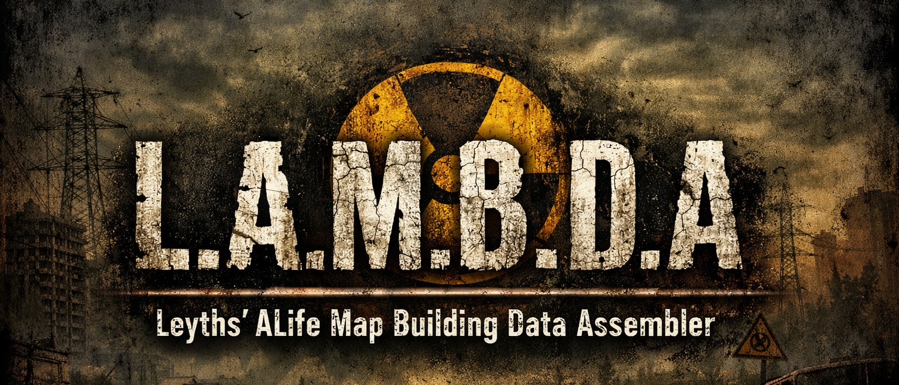

# L.A.M.B.D.A

**Leyths ALife Map Building Data Assembler**

A tool for building and merging game graph data from the X-Ray Engine. Processes multiple game levels and creates a unified `all.spawn` file containing spawn points, patrol paths, game graph topology, and cross-table references.

## Prerequisites

- Python 3.11+
- S.T.A.L.K.E.R. Anomaly or GAMMA installation (for level data extraction)
- Git

## Installation

### macOS/Linux

```bash
git clone <repo>
cd LAMBDA-stalker-anomaly-level-tools
python3.11 -m venv venv
source venv/bin/activate
pip install numpy
pip install open3d  # optional, for visualizer
```

### Windows

```powershell
git clone <repo>
cd LAMBDA-stalker-anomaly-level-tools
python -m venv venv
.\venv\Scripts\activate
pip install numpy
pip install open3d  # optional, for visualizer
```

## Level Data Extraction

You need to extract level files from your Anomaly/GAMMA installation using AXRToolset:

1. Download [AXRToolset](https://www.moddb.com/mods/stalker-anomaly/addons/axrtoolset) from ModDB
2. Open the `.db0` archives at `<GameDir>/db/levels/<level_name>.db0`
3. Extract the following files for each level:
   - `level.ai` - AI navigation mesh
   - `level.spawn` - Spawn entities
   - `level.game` - Waypoints and patrols
4. Place extracted files in `levels/<level_name>/`

## Usage

### Building all.spawn

```bash
# Main build - runs the complete pipeline
./build_anomaly.sh

# Build options
./build_anomaly.sh --force      # Force rebuild all cross tables

# Build for GAMMA mod
./build_gamma.sh

# Launch 3D visualizer
./visualise.sh
```

## Configuration

### levels.ini

Defines which levels are included in the build. Each level entry contains:

```ini
[level01]
name = k00_marsh                                    # Internal level name
caption = "k00_marsh"                               # Display name (optional)
offset = 1050.0, 1000.0, 0.0                        # World space offset (x, y, z)
path = ../levels/k00_marsh                          # Path to level folder
id = 01                                             # Unique level ID (0-255)
original_spawn = extractedanomalyspawns/k00_marsh.spawn      # Original spawn data
original_patrols = extractedanomalyspawns/k00_marsh.patrols  # Original patrol data
original_edges = extractedanomalyspawns/k00_marsh.edges.json # Original graph edges
```

### spawn_blacklist.ini

Entities listed here are excluded from the final all.spawn. Supports exact names and prefix wildcards:

```ini
# Exact match
zat_b39_anomaly_protect_helmet

# Wildcard - matches any entity starting with "debug_"
debug_*
```

### level_changers.ini

Configures cross-level teleporters. Each level changer needs destination, position, and direction:

```ini
[level_name]
entity_name.dest = destination_level
entity_name.pos = x, y, z           # Local coordinates on destination level
entity_name.dir = pitch, yaw, roll  # Camera orientation in radians
```

Level changers **not** listed in this file are removed from all.spawn.

## Project Structure

```
lambda/
├── build_anomaly.sh          # Main build for Anomaly mod
├── build_gamma.sh            # Build for GAMMA mod
├── visualise.sh              # 3D visualizer launcher
├── levels.ini                # Level definitions
├── spawn_blacklist.ini       # Entity exclusion patterns
├── level_changers.ini        # Cross-level teleport config
├── compiler/                 # Build pipeline (Python)
├── levels/                   # Level data directories
├── gamedata/                 # Build output
├── .tmp/                     # Build cache
├── visualiser/               # 3D inspector tool
└── docs/                     # Documentation
```

## Documentation

- [Architecture](docs/ARCHITECTURE.md) - Technical documentation and build pipeline details
- [Updating Levels](docs/UPDATING_LEVELS.md) - Guide for integrating modified or rebuilt levels

## Disclaimer

This project contains AI-generated code. While efforts have been made to ensure correctness, please review and test thoroughly before use in production mods.

## License

This project is provided as-is for modding purposes. S.T.A.L.K.E.R. and X-Ray Engine are trademarks of GSC Game World.
