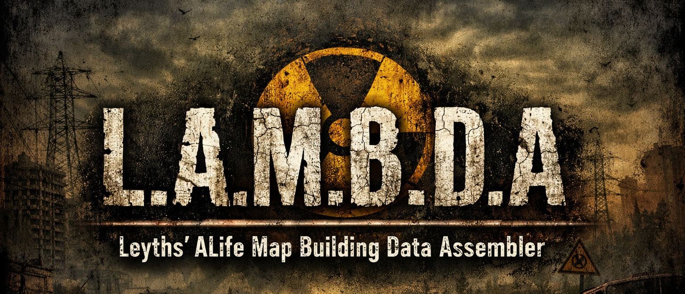

# L.A.M.B.D.A

**Leyths ALife Map Building Data Assembler**

A tool for building and merging game graph data from the X-Ray Engine.

This allows for removing or modifying any existing Anomaly level, as well as adding new levels. See [Updating Levels](docs/UPDATING_LEVELS.md) for a guide.

It does this by processing multiple game levels to create a unified `all.spawn` file containing spawn points, patrol paths, game graph topology, and cross-table references.

## Visualiser


An `all.spawn` visualiser tool is included to help debug issues and view maps in ways you never have before. See [Visualiser](docs/VISUALISER.md) for more information.

## Getting Started

Download the latest release from the releases page. Extract the zip and run `LAMBDA.exe`.

The GUI has two tabs:

### Build

Configure your build settings:
- **Levels Directory** — path to your `levels/` folder
- **Output Directory** — where `all.spawn` is written (typically `gamedata/`)
- **Base Mod** — select anomaly, cultured, or gamma

Click **Full Build** to compile, or **Deploy Scripts Only** to copy mod scripts without rebuilding.

### Visualiser

View your levels in 3D after building:
- **Path to all.spawn** — path to the built `all.spawn` file
- **Select level** — choose a level from the dropdown
- Click **View Level** to open the 3D inspector

## Configuration

### levels.ini

Defines which levels are included in the build. Each level entry contains:

```ini
[level01]
name = k00_marsh                                    # Internal level name
caption = "k00_marsh"                               # Display name (optional)
offset = 1050.0, 1000.0, 0.0                        # World space offset (x, y, z)
id = 01                                             # Unique level ID (0-255)
original_spawn = ../anomaly/k00_marsh.spawn         # Original spawn data
original_patrols = ../anomaly/k00_marsh.patrols     # Original patrol data
original_edges = ../anomaly/k00_marsh.edges.json    # Original graph edges
base_anomaly_spawns_only = true                     # Use only original spawn data (see below)
base_anomaly_waypoints_only = true                  # Use only original patrol data (see below)
connect_orphans_automatically = true                # Auto-connect orphan graph nodes (see below)
```

The level folder path is derived automatically from `<levels_dir>/<name>` at build time.

#### Level flags

**`base_anomaly_spawns_only`** and **`base_anomaly_waypoints_only`** — When set to `true`, the build pipeline will skip reading the level's compiled `level.spawn` / `level.game` files and instead use only the pre-extracted data from `original_spawn` / `original_patrols`. You should set these flags to `true` for all levels you are not modifying. This ensures the build uses known-good extracted data rather than trying to parse the compiled level files. Leave them unset (or `false`) only for levels you have specifically re-compiled with the SDK (e.g. after editing the AI mesh or adding new spawn points in the level editor).

**`connect_orphans_automatically`** — When set to `true`, the build will automatically connect any orphan graph nodes (nodes with no edges to other levels) to their nearest neighbour. This is useful for levels that have been re-compiled where the game graph edges need to be reconstructed.

### spawn_blacklist.ini

Entities listed here are excluded from the final all.spawn. Supports exact names and prefix wildcards:

```ini
# Exact match
zat_b39_anomaly_protect_helmet

# Wildcard - matches any entity starting with "debug_"
debug_*
```

### level_changers.ini

Configures cross-level teleporters. Each level changer needs destination, position, and direction:

```ini
[level_name]
entity_name.dest = destination_level
entity_name.pos = x, y, z           # Local coordinates on destination level
entity_name.dir = pitch, yaw, roll  # Camera orientation in radians
```

Level changers **not** listed in this file are removed from all.spawn.

## Documentation

- [Architecture](docs/ARCHITECTURE.md) - Technical documentation and build pipeline details
- [all.spawn Format](docs/ALL_SPAWN_FORMAT.md) - Deep dive into the all.spawn binary format, entity types, and GVIDs
- [Updating Levels](docs/UPDATING_LEVELS.md) - Guide for integrating modified or rebuilt levels
- [Mods System](docs/MODS-SYSTEM.md) - How the mod overlay and tag rewriting system works

## Disclaimer

This project contains AI-generated code. While efforts have been made to ensure correctness, please review and test thoroughly before use in production mods.

## License

This project is provided as-is for modding purposes. S.T.A.L.K.E.R. and X-Ray Engine are trademarks of GSC Game World.

## Support

Please request support in the [Monolith Hideout Discord](https://discord.com/invite/DEg83AFc6K) or raise a Github issue.

Pull requests are welcome.

## Acknowledgements

Deep thanks to Karobeccary for his knowledge of the STALKER SDK, this wouldn't have been possible without his assistance.

Thank you to [HailTheMonolith](https://www.twitch.tv/hailthemonolith) for saying this was impossible, and for his support throughout.

And thanks to bardak, Kolmogor, K.D. and the other authors of [ACDC](https://github.com/PSIget/Universal-ACDC/) which was extremely helpful in writing this.
